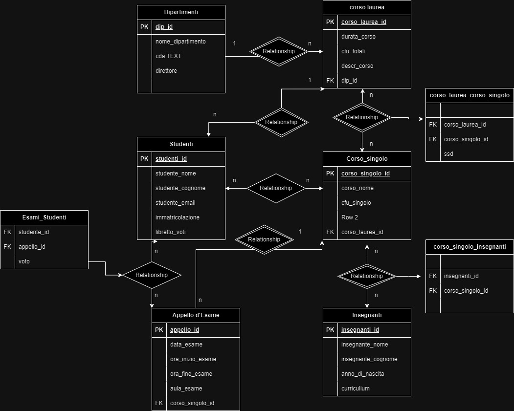

### CONSEGNA 

Modellizzare la struttura di un database per memorizzare tutti i dati riguardanti una università:
- sono presenti diversi Dipartimenti (es.: Lettere e Filosofia, Matematica, Ingegneria ecc.);

- ogni Dipartimento offre più Corsi di Laurea (es.: Civiltà e Letterature Classiche, Informatica, Ingegneria Elettronica ecc..)

- ogni Corso di Laurea prevede diversi Corsi (es.: Letteratura Latina, Sistemi Operativi 1, Analisi Matematica 2 ecc.);

- ogni Corso può essere tenuto da diversi Insegnanti;

- ogni Corso prevede più appelli d'Esame;

- ogni Studente è iscritto ad un solo Corso di Laurea;

- ogni Studente può iscriversi a più appelli di Esame;

- per ogni appello d'Esame a cui lo Studente ha partecipato, è necessario memorizzare il voto ottenuto, anche se non sufficiente. 

Pensiamo a quali entità (tabelle) creare per il nostro database e cerchiamo poi di stabilirne le relazioni. Infine, andiamo a definire le colonne e i tipi di dato di ogni tabella.

---

## TIPOLOGIA DI DATI

**DIPARTIMENTO:**

dip_id INT PRIMARY KEY AUTO_INCREMENT UNIQUE,
nome_dipartimento VARCHAR(255) NOT NULL,
cda TEXT NOT NULL
direttore VARCHARD(255) NOT NULL, 

______________

**CORSO DI LAUREA**

corso_laurea_id INT PRIMARY KEY AUTO_INCREMENT UNIQUE,
Corso_laurea_nome VARCHAR(100) NOT NULL,
durata_corso VARCHAR(100) NOT NULL,
cfu_totali INT UNSIGNED NOT NULL, 
descr_corso TEXT NULL, 
dip_id FK RELATED TO DIP_ID

____________________________

**CORSO SINGOLO:**

corso_singolo_id INT PRIMARY KEY AUTO_INCREMENT UNIQUE,
corso_nome VARCHARD(255) NOT NULL,
cfu_singolo INT UNSIGNED NOT NULL, 
corso_laurea_id fk related to corso_di_laurea

______________________________

**CORSO DI LAUREA / CORSO SINGOLO**

ssd VARCHAR(10) NULL;

______________________________

**INSEGNANTI**

insegnanti_id INT PRIMARY KEY AUTO_INCREMENT UNIQUE,
insengnati_nome VARCHARD(255) NOT NULL,
insegnanti_cognome VARCHARD(255) NOT NULL,
anno_di_nascita DATE NOT NULL,
curriculum VARCHAR(255) NOT NULL,
insegnante_mail VARCHAR(100) NOT NULL, 
orario_ricevimento VARCHAR(100) NOT NULL,

_____________________________________________________

**STUDENTI**

studenti_id INT PRIMARY KEY AUTO_INCREMENT UNIQUE,
studenti_nome VARCHARD(255) NOT NULL,
studenti_cognome VARCHARD(255) NOT NULL,
studente_mail VARCHAR(100) NOT NULL, 
immatricolazione INT NOT NULL, 
libretti_voti TEXT NOT NULL 
________________________________________

**APPELLI D'ESAME**

appello_id INT PRIMARY KEY AUTO_INCREMENT UNIQUE,
data_esame DATE NULL, 
ora_inizio TIME NULL
ora_fine TIME NULL, 
aula_Esame VARCHAR(100) NULL,
fk corso singolo id

________________________

**ESAMI STUDENTI:**

voto TINY INT NOT NULL,

---
### DIAGRAMMA

